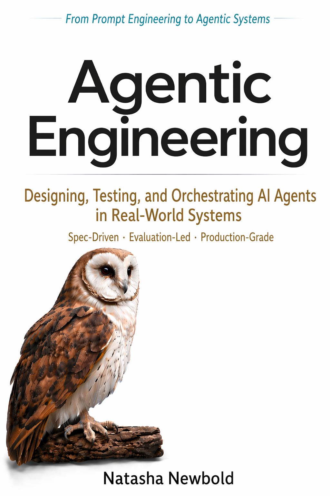

### Hi, I'm Natasha 👋

#### AI for Science · Agentic Systems · Responsible & Embodied AI · Research & Engineering 🚀

I design and evaluate advanced AI systems for scientific reasoning, experimentation, and decision-making in complex, high-uncertainty research and engineering environments.

## Selected Work

<table>
  <thead>
    <tr>
      <th>Project</th>
      <th>Description</th>
    </tr>
  </thead>
  <tbody>
    <tr>
      <td>AI Security and Safety Triage</td>
      <td>Production-grade AI security and safety triage systems for structured review, risk analysis, and operational follow-through.</td>
    </tr>
    <tr>
      <td>Autonomous Research Design</td>
      <td>Autonomous research design systems that transform hypotheses into rigorous, preregistration-ready study protocols.</td>
    </tr>
    <tr>
      <td>Multimodal Narrative Pipelines</td>
      <td>Interleaved multimodal pipelines that turn spoken narratives into coherent visual and cinematic artefacts.</td>
    </tr>
    <tr>
      <td>AI Incident Response</td>
      <td>AI incident-response platforms for outage investigation, runbook retrieval, root-cause analysis, remediation support, and postmortem drafting.</td>
    </tr>
    <tr>
      <td>Healthcare Agent Interoperability</td>
      <td>Interoperable healthcare agent systems spanning clinical workflows, protocol exchange, and standards-based integration.</td>
    </tr>
    <tr>
      <td>Reasoning Optimisation Systems</td>
      <td>Closed-loop reasoning optimisation systems that diagnose, repair, and enforce structured problem-solving behaviour in language models.</td>
    </tr>
    <tr>
      <td>Cognitive Benchmarking</td>
      <td>Task-driven cognitive benchmarks that isolate reasoning capabilities, failure modes, and adaptation under controlled conditions.</td>
    </tr>
    <tr>
      <td>Urban Intelligence Systems</td>
      <td>Location-aware urban intelligence systems that model places, movement, and real-world context for decision support and experience design.</td>
    </tr>
  </tbody>
</table>

  
  My book, Prompt Engineering AI, was among the earlier books published on prompt engineering in early 2023. Now evolved into its third edition as Agentic Engineering, it reflects the field’s progression from prompting alone to the design, evaluation, testing, and orchestration of AI agents in real-world systems — spanning context engineering, spec-driven development, skills- and CLI-based operating models, and production-aware agentic workflows.

 

---

### Projects Open for Contribution

  
 🔦 Contributors Welcome: 

| Repository | Description | Stars | Forks |
|------------|-------------|-------|-------|
| [Awesome-Prompt-Engineering](https://github.com/natnew/Awesome-Prompt-Engineering) | A curated collection of prompt engineering resources |  |  |
| [Awesome-Generative-AI](https://github.com/natnew/Awesome-Generative-AI) | A curated collection of generative AI resources |  |  |
| [Awesome-AI-Scientists](https://github.com/natnew/awesome-ai-scientists) | Resources for building AI Scientist systems: literature intelligence, hypothesis generation, experiment planning, tool-use, evaluation, and scientific communication |  |  |
| [Awesome-Physical-AI](https://github.com/natnew/awesome-physical-ai) | A curated list of Robotics + AI resources for Physical AI / Embodied AI |  |  |
| [Awesome-Agentic-Engineering](https://github.com/natnew/Awesome-Agentic-Engineering) | A curated collection of agentic engineering resources |  |  |
| [Awesome-AgentOps](https://github.com/natnew/awesome-agentops) | AgentOps resources for operating, evaluating, and improving agent systems |  |  |
| [Awesome-RL-for-Agents](https://github.com/natnew/awesome-rl-for-agents) | Reinforcement learning resources for agentic systems |  |  |
| [Awesome-Simulation-Engines-for-Social-Science](https://github.com/natnew/awesome-simulation-engines-for-social-science) | Simulation engines and tools for social science research |  |  |

### Find Me:

  
 🔦 Profiles: 

   <table>
     <tr>
       <td> <a href="https://www.linkedin.com/in/natasha-newbold/"> Linkedin </a></td>
       <td> <a href="https://medium.com/@natashanewbold"> Medium </a></td>
       <td> <a href="https://stackoverflow.com/users/18646307/natasha?tab=profile"> Stack Overflow </a></td>
       <td> <a href="https://leetcode.com/NatNew91/"> Leetcode </a></td>
       <td> <a href="https://www.freecodecamp.org/natasha"> FreeCodeCamp </a></td>
       <td> <a href="https://app.datacamp.com/portfolio/natashanewboldlondon"> DataCamp </a></td>
       <td> <a href="https://codepen.io/NAT91"> CodePen </a></td>
       <td> <a href="https://www.kaggle.com/natashalondon"> Kaggle </a></td>
     </tr>
     <tr>
<td> </td>
<td> </td>
<td> </td>
<td> </td>
<td> </td>
<td> </td>
<td> </td>
<td> </td>
     </tr>
  </table>

<h3 align="left">Languages and Tools:</h3>

<!--
**natnew/natnew** is a ✨ _special_ ✨ repository because its `README.md` (this file) appears on your GitHub profile.
-->

